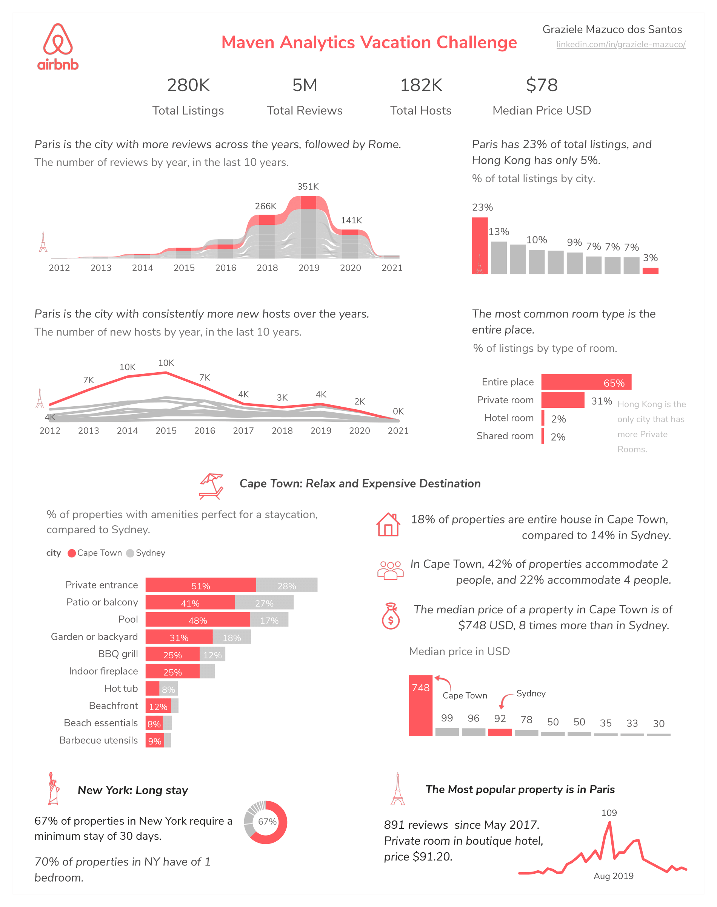

## Portfolio

---

### Visual Resume 
I created this visual resume using Power BI as part of the community Storytelling With Data challenge.
You can find the interactive version of the resume here: [Visual Resume in Power BI](https://bit.ly/3clnZqf)

---

### Maven Analytics Vacation Challenge

This was an exciting [challenge](https://www.mavenanalytics.io/blog/maven-vacation-challenge) with a massive dataset from Airbnb make available by Maven Analytics. 

Here are some takeaways from my exploratory analysis:

• Paris is the city with more reviews, more listings, and more new hosts over the years. 

• Entire place is the most common type of property in the 10 cities analyzed, however in Hong Kong the most common type is Private Room.

• Cape Town looks like a destination to relax, being the destination with a combo of amenities for a calm staycation with family. But this also has a cost as Cape Town has the highest median price being almost 8 times more expensive than Sydney, Paris, or New York.

• New York has the highest amount of properties requiring a minimum stay of at least 30 days, 67% of all listings comparing with Paris, only 4% of listings have this requirement.

• Paris has the most popular property, with 891 reviews since May 2017. It is a private room in a boutique hotel.

[Link to the report in Power BI](https://bit.ly/3aIqJw7)

